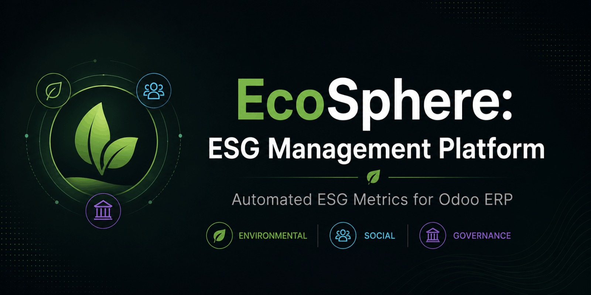
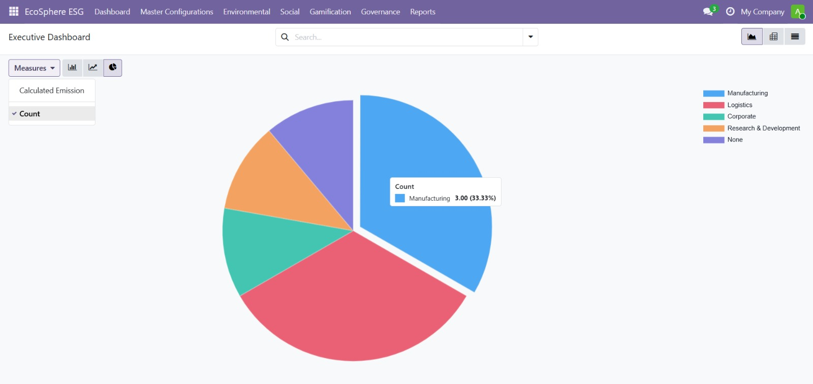
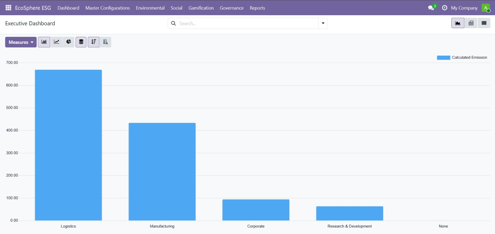
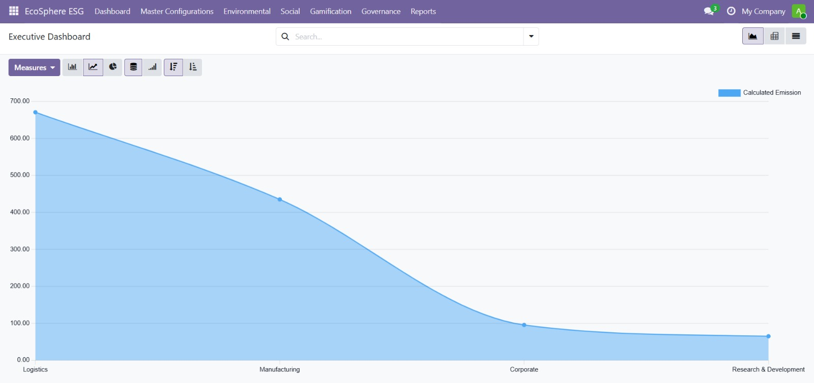
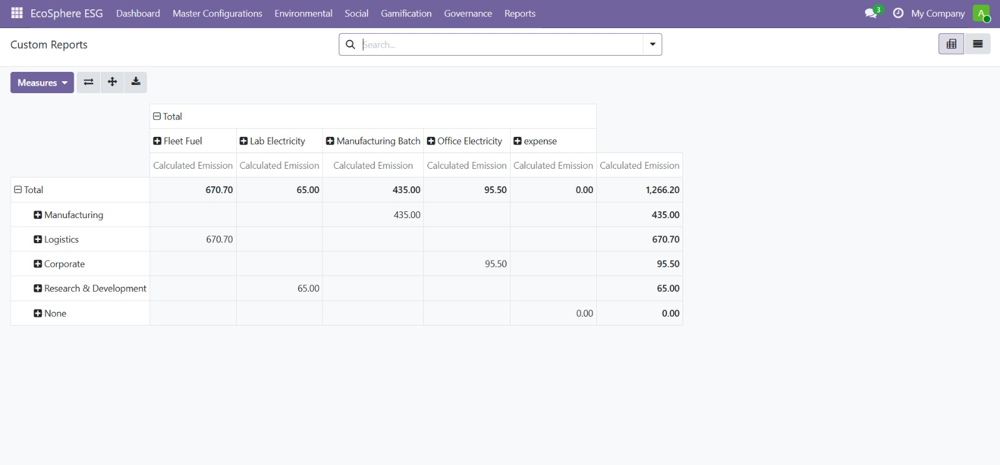
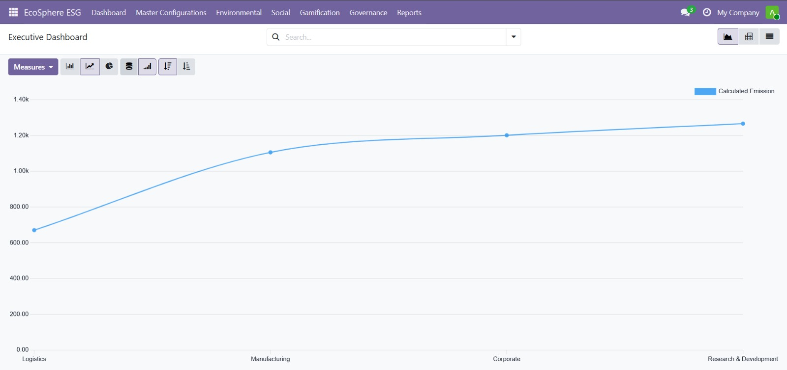

# EcoSphere: ESG Management Platform



EcoSphere is a custom Odoo ERP module engineered to integrate Environmental, Social, and Governance (ESG) metrics directly into daily business operations. It replaces manual sustainability tracking with an automated, analytical workflow that drives accountability at scale.

## 🎥 Demo Video

Watch the complete project demonstration here:

**Demo Video:** https://drive.google.com/file/d/1o9MdbIt2pg8-xzvT_KZZRF2CzN_VS9Ql/view

---

## The Business Solution

Modern organizations require actionable insights, not just raw data. EcoSphere bridges the gap between operational execution and corporate sustainability goals. It embeds sustainability tracking directly into the ERP environment, capturing carbon emissions from daily transactions, enforcing compliance, and incentivizing employee participation. The result is a real-time, unified dashboard that delivers clear business value.

## Why Odoo?

EcoSphere was built on the Odoo framework for three core reasons:

- **Unified Data Core:** Unlike standalone ESG software, Odoo shares a single database with Purchasing, Manufacturing, and Fleet management, allowing for automated carbon footprint calculations without manual re-entry.
- **Modular Scalability:** Odoo’s architecture allows us to seamlessly layer Environmental, Social, and Governance modules atop standard ERP workflows.
- **User Engagement:** By leveraging Odoo’s flexible web framework, we built an integrated gamification layer (XP, Badges, Leaderboards) that is natively accessible to all employees within their existing work environment.

## Core Capabilities

- Automated Carbon Ledger: Calculates emissions dynamically from purchasing, manufacturing, and fleet operations.
- Governance & Compliance: Tracks policies, audit results, and assigns clear ownership to compliance issues.
- Gamified CSR: Drives employee engagement via XP-based sustainability challenges and redeemable rewards.
- Evidence Enforcement: Mandates documentation for CSR approvals to maintain audit readiness.
- Weighted Department Scoring: Aggregates environmental, social, and governance metrics into clear performance rankings.

## 📸 Platform Preview

### Executive Dashboard - Emission Distribution



### Department-wise Carbon Emissions



### Emissions Trend Analysis



### Custom Pivot Report



### Executive Analytics



## Technical Architecture

Built as a modular Odoo application, EcoSphere utilizes a dual data model structure:

### Master Data

- Departments
- Emission Factors
- Goals
- Policies
- Categories
- Badges
- Rewards

### Transactional Data

- Carbon Transactions
- CSR Activity
- Challenge Participations
- Compliance Audits

> ⚠️ **Important Note: Sample Data**
>
> This module includes a built-in demo dataset (`data/esg_demo_data.xml`) for testing and visualization purposes. This data is purely synthetic (dummy data) and is intended to populate the executive dashboard, pivot tables, and KPI cards immediately upon installation. Do not use this data for official reporting.

## Installation Guide

### Phase 1: Environment Setup

1. Download and install Odoo 19.0 Community Edition for Windows.
2. Create a new database (`ecosphere_db`). Ensure the **Demo Data** box is unchecked.

### Phase 2: Code Deployment

1. Navigate to your Odoo installation's core addons directory:

   ```text
   C:\Program Files\Odoo 19.0\server\odoo\addons
   ```

2. Clone this repository into the folder named `ecosphere_esg`.
3. Restart the `odoo-server-19.0` service via the Windows Services app to register the new models.

### Phase 3: Module Activation

1. Enable Developer Mode in the Odoo Settings app.
2. Navigate to **Apps**, click **Update Apps List**, and confirm.
3. Search for **EcoSphere**, then click **Activate**.
4. The Executive Dashboard and all reports will now be available in the top navigation bar.

## Business Rules Implemented

- Auto-Emission Calculation: Carbon metrics are derived directly from ERP transactions when toggled in Settings.
- Evidence Requirement: CSR participation requires proof-of-completion attachments.
- Badge Auto-Awarding: Rewards and badges are triggered instantly by XP milestones.
- Compliance Flags: Overdue compliance issues are automatically highlighted using conditional formatting.

## Contributors

- Dande Tejaswini (Team Lead)
- Parvez Sharief (Team Member)
